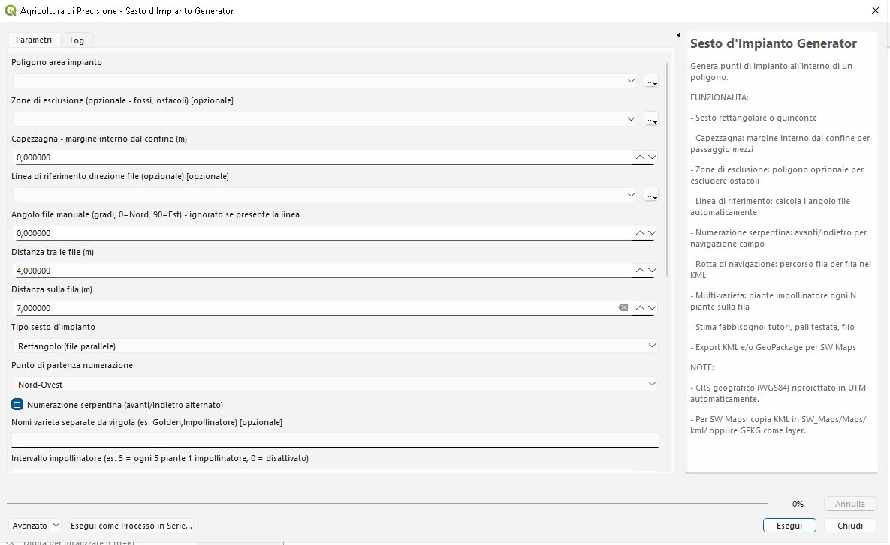
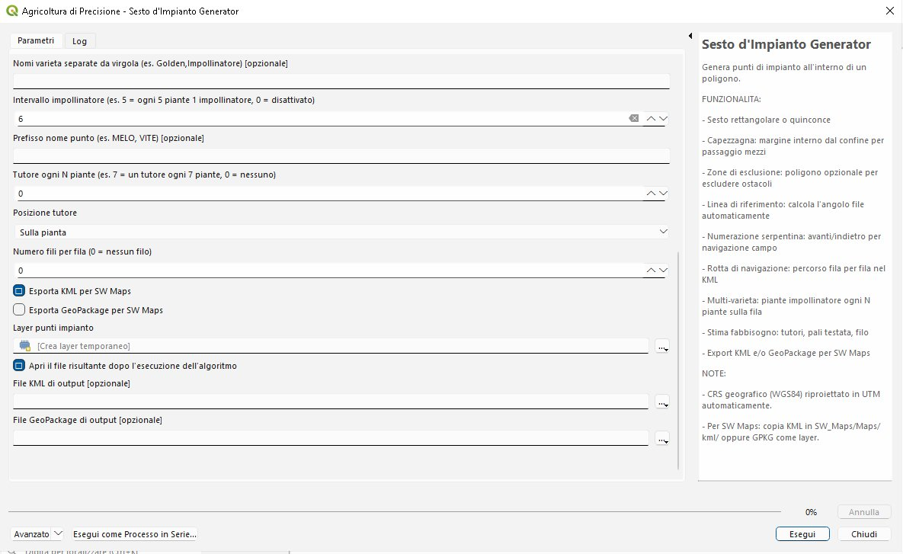
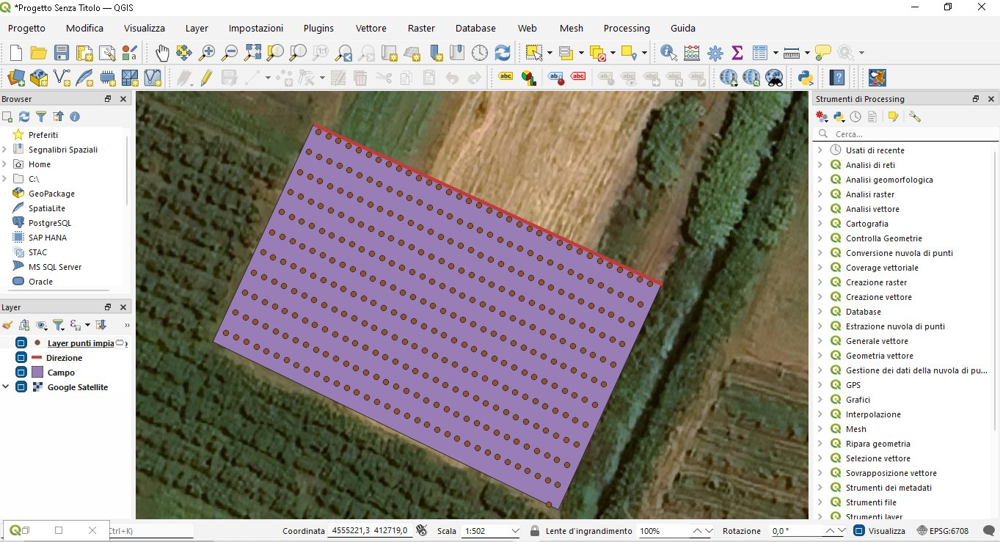
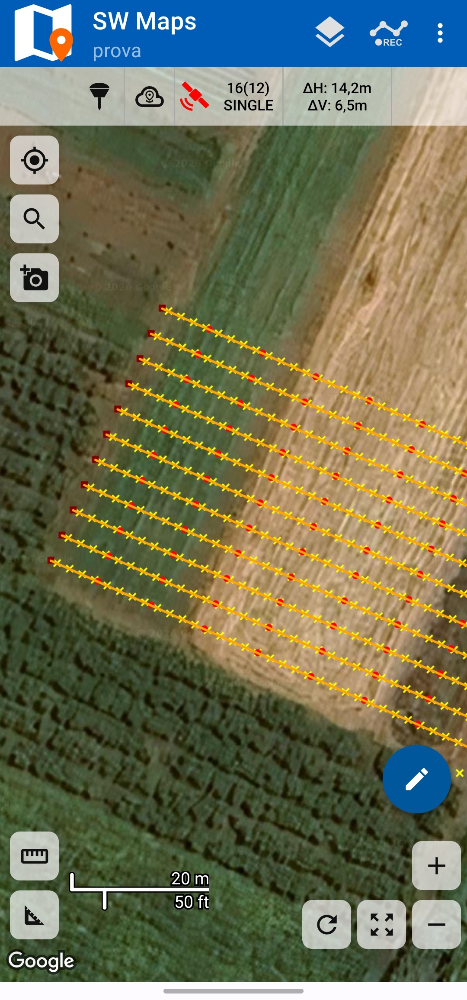
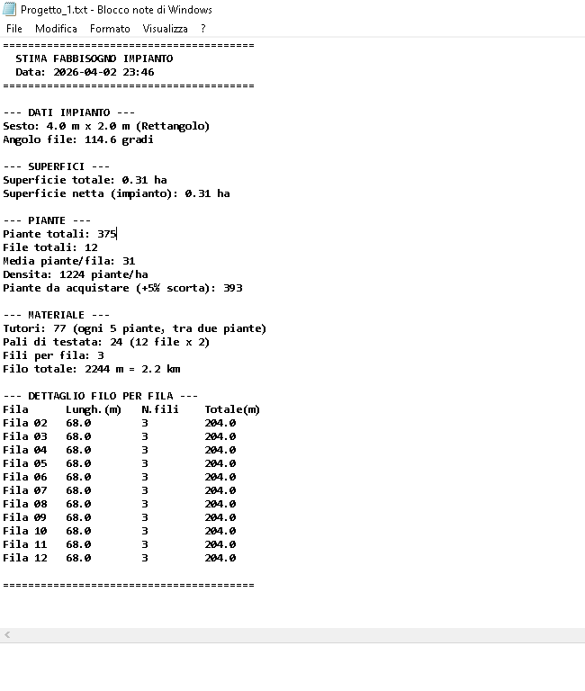

# 🌱 Generatore Sesto d'Impianto 🌱

🇮🇹 [Italiano](#italiano) | 🇬🇧 [English](#english)

---

# Italiano

**Script di Processing per QGIS** — Genera automaticamente i punti di impianto all'interno di un'area poligonale, con esportazione pronta per la navigazione in campo tramite **SW Maps + RTK**.

Pensato per agronomi, vivaisti e tecnici agricoli che devono progettare nuovi impianti arborei (frutteti, vigneti, oliveti, noccioleti...) e portare i punti direttamente in campo con un ricevitore GNSS.

---

## Funzionalità

### Generazione sesto d'impianto

Lo script genera una griglia regolare di punti all'interno di un poligono disegnato in QGIS. Sono supportati due tipi di sesto:

- **Rettangolo** — file parallele con piante allineate tra le file
- **Quinconce** — file parallele con piante sfalsate di mezzo passo nelle file alterne, per ottimizzare l'intercettazione della luce

L'orientamento delle file si imposta in due modi: inserendo manualmente l'angolo in gradi (0° = Nord, 90° = Est), oppure disegnando una **linea di riferimento** su QGIS nella direzione desiderata — lo script calcola l'azimut automaticamente.

### Capezzagna

Il parametro "margine interno" applica un buffer negativo al poligono prima di generare i punti. Se ad esempio imposti 5 metri, i punti partiranno a 5 m dal bordo dell'appezzamento, lasciando spazio per la capofila e il passaggio dei mezzi.

### Zone di esclusione

Puoi fornire un secondo layer poligono che rappresenta ostacoli da evitare: fossi, alberi esistenti, capannoni, strade interpoderali. Lo script sottrae queste aree dal poligono principale prima della generazione, quindi nessun punto cadrà mai in una zona esclusa.

### Numerazione serpentina

Quando attivata, le file vengono numerate con direzione alternata: la fila 1 va da sinistra a destra, la fila 2 da destra a sinistra, la fila 3 di nuovo da sinistra, e così via. Questo rispecchia il percorso naturale di chi cammina tra le file e ottimizza la navigazione in campo con il ricevitore RTK.

### Rotta di navigazione

Nel file KML viene generata una linea che collega tutti i punti nell'ordine di percorrenza (fila per fila, rispettando la serpentina). In SW Maps puoi visualizzarla come traccia da seguire in campo.

### Multi-varietà e impollinatori

Specificando i nomi delle varietà separati da virgola (es. `Golden,Impollinatore`) e un intervallo (es. `5`), lo script assegna automaticamente la varietà impollinatore ogni N piante sulla fila. Ogni pianta nel layer risultante ha l'attributo `varieta` compilato.

L'assegnazione è per pianta, non per fila: in una fila con intervallo 5 avrai pianta 1-4 Golden, pianta 5 Impollinatore, pianta 6-9 Golden, pianta 10 Impollinatore, e così via.

Nel KML le varietà sono visualizzate con colori diversi per un immediato riscontro visivo.

### Tutori con distribuzione uniforme

I tutori vengono posizionati ogni N piante con distribuzione uniforme e simmetrica. Lo script calcola il numero di tutori necessari per la fila e li distribuisce in modo che lo scarto alle estremità sia uguale da entrambi i lati.

Ad esempio, con 23 piante e intervallo 10: 2 tutori alle posizioni 8 e 15, creando tre segmenti di 8-7-8 piante.

Si può scegliere se posizionare il tutore:

- **Sulla pianta** — il tutore coincide con la posizione della pianta più vicina
- **Tra due piante** — il tutore è posizionato nel punto interpolato tra le due piante adiacenti

### Pali di testata

Vengono generati automaticamente due punti per ogni fila, posizionati 1 metro oltre la prima e l'ultima pianta lungo la direzione della fila. Rappresentano i pali di testata dell'impalcatura.

### Stima fabbisogno materiale

Al termine della generazione, lo script produce un report completo con:

- Piante totali e per varietà, con il +5% di scorta
- Numero di tutori e posizionamento
- Pali di testata (2 per fila)
- Filo totale in metri e km, con dettaglio per fila (lunghezza palo-palo × numero fili)
- Superficie totale e netta, densità piante/ha

Il report viene salvato come file `.txt` nella stessa cartella del file di output, con lo stesso nome (es. `impianto_melo.gpkg` → `impianto_melo.txt`).

### Esportazione

Lo script esporta in due formati, attivabili indipendentemente:

**KML** — File singolo con:
- Cartella per ogni fila contenente i punti pianta
- Colori diversi per varietà
- Linea rotta di navigazione
- Pronto per SW Maps: copiare in `SW_Maps/Maps/kml/` sul telefono

**GeoPackage** — File multi-layer con:
- `piante_[prefisso]` — punti pianta con tutti gli attributi
- `pali_testata_[prefisso]` — punti pali di testata (inizio/fine fila)
- `tutori_[prefisso]` — punti tutori con distribuzione uniforme
- `fili_[prefisso]` — linee da palo a palo per ogni fila, con lunghezza e stima filo

In SW Maps ogni layer può essere acceso o spento indipendentemente a seconda dell'operazione in corso.

### Gestione CRS

Se il layer è in coordinate geografiche (WGS84 / EPSG:4326), lo script rileva automaticamente la zona UTM corretta dall'estensione del layer e riproietta internamente per tutti i calcoli in metri. I risultati vengono riportati nel CRS originale del progetto.

---

## Installazione

### Requisiti

- QGIS 3.x (testato su QGIS 3.34 LTR)

### Metodo 1 — Copia manuale

Copia il file `sesto_impianto_generator.py` nella cartella degli script di Processing:

| Sistema operativo | Percorso |
|---|---|
| Windows | `%appdata%\QGIS\QGIS3\profiles\default\processing\scripts\` |
| Linux | `~/.local/share/QGIS/QGIS3/profiles/default/processing/scripts/` |
| macOS | `~/Library/Application Support/QGIS/QGIS3/profiles/default/processing/scripts/` |

> **Nota:** su Windows la cartella `AppData` è nascosta. Incolla `%appdata%\QGIS\QGIS3\profiles\default\processing\scripts\` direttamente nella barra degli indirizzi di Esplora File. Se la cartella `scripts` non esiste, creala.

Dopo la copia, riavvia QGIS oppure aggiorna la Sketched di Processing.

### Metodo 2 — Da QGIS

1. Apri **Processing → Sketched** (`Ctrl+Alt+T`)
2. In alto, icona **Script** → **Aggiungi script da file...**
3. Seleziona `sesto_impianto_generator.py`

Lo strumento apparirà in: **Processing Sketched → Agricoltura di Precisione → Sesto d'Impianto Generator**

---

## Utilizzo

### Parametri

| Parametro | Descrizione | Default |
|---|---|---|
| **Poligono area impianto** | Layer poligonale con l'area da impiantare | — |
| **Zone di esclusione** | Layer poligonale opzionale con aree da evitare | — |
| **Capezzagna** | Margine interno dal confine, in metri | 0 |
| **Linea di riferimento** | Layer linea opzionale per l'orientamento delle file | — |
| **Angolo file manuale** | Azimut in gradi (0=Nord, 90=Est). Ignorato se presente la linea | 0 |
| **Distanza tra le file** | Spaziatura tra file parallele, in metri | 4.0 |
| **Distanza sulla fila** | Spaziatura tra piante nella stessa fila, in metri | 2.0 |
| **Tipo sesto** | Rettangolo o Quinconce | Rettangolo |
| **Punto di partenza** | Da dove inizia la numerazione: NO, NE, SO, SE | Nord-Ovest |
| **Numerazione serpentina** | Alterna la direzione fila per fila | Sì |
| **Nomi varietà** | Separate da virgola (es. `Golden,Impollinatore`) | — |
| **Intervallo impollinatore** | Ogni N piante, 0 = disattivato | 0 |
| **Prefisso nome punto** | Es. `MELO`, `VITE` — compare nei nomi waypoint | — |
| **Tutore ogni N piante** | 0 = nessun tutore | 0 |
| **Posizione tutore** | Sulla pianta oppure tra due piante | Sulla pianta |
| **Numero fili per fila** | Per calcolo filo totale, 0 = nessuno | 0 |
| **Esporta KML** | Genera file KML per SW Maps | Sì |
| **Esporta GeoPackage** | Genera file GPKG multi-layer | No |

### Esempio pratico: frutteto di meli

1. Disegna il poligono dell'appezzamento in QGIS
2. Disegna un poligono per il fosso da escludere (opzionale)
3. Disegna una linea nella direzione desiderata delle file
4. Apri lo script dalla Processing Sketched
5. Imposta:
   - Distanza tra le file: **4.0 m**
   - Distanza sulla fila: **1.5 m**
   - Capezzagna: **5 m**
   - Tipo: **Rettangolo**
   - Varietà: **Golden,Fuji Impollinatore**
   - Intervallo impollinatore: **5**
   - Prefisso: **MELO**
   - Tutore ogni: **7** piante, **tra due piante**
   - Fili: **3**
6. Esporta KML + GeoPackage
7. Trasferisci i file sul telefono

### Importare in SW Maps

**KML:**
1. Copia il file `.kml` nella cartella `SW_Maps/Maps/kml/` del telefono
2. In SW Maps: icona Layer → Aggiungi → KML → seleziona il file

**GeoPackage:**
1. Copia il file `.gpkg` sul telefono
2. In SW Maps: icona Layer → Aggiungi → GeoPackage → seleziona il file e i layer desiderati

### Navigazione in campo

- Ordina i waypoint per nome per seguire la sequenza serpentina
- Il formato `F01P001` indica Fila 01, Pianta 001
- La rotta nel KML mostra il percorso ottimale fila per fila
- Con RTK centimetrico, posiziona il picchetto/pianta quando la precisione è sufficiente

---

## Screenshot

### Interfaccia dello script in QGIS

Il pannello parametri è diviso in sezioni logiche: area, orientamento, sesto, navigazione, varietà, materiale ed export.

### Risultato in QGIS

Punti di impianto generati all'interno del poligono (viola), con la linea di riferimento per la direzione delle file (rosso).

### Navigazione in campo con SW Maps

Selezione dei layer dal GeoPackage: piante, pali di testata, tutori e fili, ciascuno attivabile indipendentemente.

Tutti i layer visualizzati insieme: linee fila (giallo), punti pianta (giallo), tutori e pali di testata (rosso).

Vista ravvicinata con layer piante e tutori sovrapposti all'ortofoto.

### Stima fabbisogno materiale

Report generato automaticamente con il riepilogo di piante, tutori, pali, filo e dettaglio per fila.

---

## Note tecniche

- **Multi-poligono:** se il layer contiene più feature vengono unite automaticamente prima della generazione
- **Performance:** testato fino a circa 50.000 punti senza problemi
- **Quinconce:** le file pari sono sfalsate di metà passo sulla fila
- **Distribuzione tutori:** algoritmo simmetrico che divide la fila in segmenti uguali, minimizzando lo scarto alle estremità
- **Pali di testata:** posizionati con offset di 1 metro oltre la prima e ultima pianta lungo la direzione della fila

---

## Licenza

Questo progetto è rilasciato con licenza [GPL-3.0](LICENSE). Chiunque può usare, modificare e redistribuire lo script, a condizione che le modifiche vengano rilasciate con la stessa licenza open source.

---

## Contribuire

Segnalazioni di bug, richieste di funzionalità e pull request sono benvenute. Apri una [issue](../../issues) per discutere modifiche importanti prima di procedere.

---
---

# English

**QGIS Processing Script** — Automatically generates planting points within a polygon area, with export ready for field navigation via **SW Maps + RTK**.

Designed for agronomists, nursery operators, and agricultural technicians who need to plan new tree plantations (orchards, vineyards, olive groves, hazelnut groves...) and bring the points directly to the field with a GNSS receiver.

---

## Features

### Planting pattern generation

The script generates a regular grid of points within a polygon drawn in QGIS. Two planting patterns are supported:

- **Rectangle** — parallel rows with plants aligned across rows
- **Quincunx** — parallel rows with plants offset by half the in-row spacing in alternate rows, optimizing light interception

Row orientation can be set in two ways: manually entering the angle in degrees (0° = North, 90° = East), or by drawing a **reference line** in QGIS in the desired direction — the script calculates the azimuth automatically.

### Headland buffer

The "inner margin" parameter applies a negative buffer to the polygon before generating points. For example, setting 5 meters means points will start 5 m from the field boundary, leaving space for machinery turning.

### Exclusion zones

You can provide a second polygon layer representing obstacles to avoid: ditches, existing trees, buildings, farm roads. The script subtracts these areas from the main polygon before generation, so no point will ever fall in an excluded zone.

### Serpentine numbering

When enabled, rows are numbered with alternating direction: row 1 goes left to right, row 2 right to left, row 3 left again, and so on. This mirrors the natural walking path between rows and optimizes field navigation with the RTK receiver.

### Navigation route

The KML file includes a line connecting all points in traversal order (row by row, following the serpentine pattern). In SW Maps you can display it as a track to follow in the field.

### Multi-variety and pollinators

By specifying variety names separated by commas (e.g. `Golden,Pollinator`) and an interval (e.g. `5`), the script automatically assigns the pollinator variety every N plants along the row. Each plant in the resulting layer has the `varieta` attribute filled in.

Assignment is per plant, not per row: in a row with interval 5 you'll get plants 1-4 Golden, plant 5 Pollinator, plants 6-9 Golden, plant 10 Pollinator, and so on.

In the KML, varieties are displayed with different colors for immediate visual feedback.

### Stakes with uniform distribution

Stakes are placed every N plants with uniform and symmetrical distribution. The script calculates the number of stakes needed for the row and distributes them so that the gap at both ends is equal.

For example, with 23 plants and interval 10: 2 stakes at positions 8 and 15, creating three segments of 8-7-8 plants.

You can choose whether to place the stake:

- **On the plant** — the stake coincides with the nearest plant position
- **Between two plants** — the stake is positioned at the interpolated point between two adjacent plants

### End posts

Two points are automatically generated for each row, positioned 1 meter beyond the first and last plant along the row direction. These represent the trellis end posts.

### Material requirements estimate

After generation, the script produces a complete report with:

- Total plants and per variety, with +5% spare
- Number of stakes and positioning
- End posts (2 per row)
- Total wire in meters and km, with per-row detail (post-to-post length × number of wires)
- Total and net area, plant density/ha

The report is saved as a `.txt` file in the same folder as the output file, with the same name (e.g. `orchard_apple.gpkg` → `orchard_apple.txt`).

### Export

The script exports in two formats, independently selectable:

**KML** — Single file with:
- Folder for each row containing plant points
- Different colors per variety
- Navigation route line
- Ready for SW Maps: copy to `SW_Maps/Maps/kml/` on phone

**GeoPackage** — Multi-layer file with:
- `piante_[prefix]` — plant points with all attributes
- `pali_testata_[prefix]` — end post points (start/end of row)
- `tutori_[prefix]` — stake points with uniform distribution
- `fili_[prefix]` — post-to-post lines for each row, with length and wire estimate

In SW Maps each layer can be toggled on/off independently depending on the current operation.

### CRS handling

If the layer is in geographic coordinates (WGS84 / EPSG:4326), the script automatically detects the correct UTM zone from the layer extent and reprojects internally for all calculations in meters. Results are returned in the original project CRS.

---

## Installation

### Requirements

- QGIS 3.x (tested on QGIS 3.34 LTR)

### Method 1 — Manual copy

Copy `sesto_impianto_generator.py` to the Processing scripts folder:

| OS | Path |
|---|---|
| Windows | `%appdata%\QGIS\QGIS3\profiles\default\processing\scripts\` |
| Linux | `~/.local/share/QGIS/QGIS3/profiles/default/processing/scripts/` |
| macOS | `~/Library/Application Support/QGIS/QGIS3/profiles/default/processing/scripts/` |

> **Note:** on Windows the `AppData` folder is hidden. Paste `%appdata%\QGIS\QGIS3\profiles\default\processing\scripts\` directly in File Explorer's address bar. Create the `scripts` folder if it doesn't exist.

After copying, restart QGIS or refresh the Processing Sketched.

### Method 2 — From QGIS

1. Open **Processing → Sketched** (`Ctrl+Alt+T`)
2. At the top, **Script** icon → **Add script from file...**
3. Select `sesto_impianto_generator.py`

The tool will appear in: **Processing Sketched → Agricoltura di Precisione → Sesto d'Impianto Generator**

---

## Usage

### Parameters

| Parameter | Description | Default |
|---|---|---|
| **Planting area polygon** | Polygon layer with the area to plant | — |
| **Exclusion zones** | Optional polygon layer with areas to avoid | — |
| **Headland** | Inner margin from boundary, in meters | 0 |
| **Reference line** | Optional line layer for row orientation | — |
| **Manual row angle** | Azimuth in degrees (0=North, 90=East). Ignored if line is provided | 0 |
| **Row spacing** | Spacing between parallel rows, in meters | 4.0 |
| **In-row spacing** | Spacing between plants in the same row, in meters | 2.0 |
| **Planting pattern** | Rectangle or Quincunx | Rectangle |
| **Starting corner** | Where numbering begins: NW, NE, SW, SE | North-West |
| **Serpentine numbering** | Alternates direction row by row | Yes |
| **Variety names** | Comma-separated (e.g. `Golden,Pollinator`) | — |
| **Pollinator interval** | Every N plants, 0 = disabled | 0 |
| **Point name prefix** | E.g. `APPLE`, `VINE` — appears in waypoint names | — |
| **Stake every N plants** | 0 = no stakes | 0 |
| **Stake position** | On plant or between two plants | On plant |
| **Wires per row** | For total wire calculation, 0 = none | 0 |
| **Export KML** | Generate KML file for SW Maps | Yes |
| **Export GeoPackage** | Generate multi-layer GPKG file | No |

### Practical example: apple orchard

1. Draw the field polygon in QGIS
2. Draw a polygon for the ditch to exclude (optional)
3. Draw a line in the desired row direction
4. Open the script from the Processing Sketched
5. Set:
   - Row spacing: **4.0 m**
   - In-row spacing: **1.5 m**
   - Headland: **5 m**
   - Pattern: **Rectangle**
   - Varieties: **Golden,Fuji Pollinator**
   - Pollinator interval: **5**
   - Prefix: **APPLE**
   - Stake every: **7** plants, **between two plants**
   - Wires: **3**
6. Export KML + GeoPackage
7. Transfer files to phone

### Import in SW Maps

**KML:**
1. Copy the `.kml` file to `SW_Maps/Maps/kml/` on the phone
2. In SW Maps: Layer icon → Add → KML → select file

**GeoPackage:**
1. Copy the `.gpkg` file to the phone
2. In SW Maps: Layer icon → Add → GeoPackage → select file and desired layers

### Field navigation

- Sort waypoints by name to follow the serpentine sequence
- Format `F01P001` means Row 01, Plant 001
- The KML route shows the optimal row-by-row path
- With centimeter-level RTK, place the stake/plant when accuracy is sufficient

---

## Screenshots

### QGIS script interface

The parameter panel is divided into logical sections: area, orientation, pattern, navigation, varieties, materials, and export.

### Result in QGIS

Planting points generated within the polygon (purple), with the reference line for row direction (red).

### Field navigation with SW Maps

GeoPackage layer selection: plants, end posts, stakes, and wires — each togglable independently.

All layers displayed together: row lines (yellow), plant points (yellow), stakes and end posts (red).

Close-up view with plant and stake layers over the orthophoto.

### Material requirements report

Automatically generated report with summary of plants, stakes, posts, wire, and per-row detail.

---

## Technical notes

- **Multi-polygon:** if the layer contains multiple features they are merged automatically before generation
- **Performance:** tested up to approximately 50,000 points without issues
- **Quincunx:** even rows are offset by half the in-row spacing
- **Stake distribution:** symmetrical algorithm that divides the row into equal segments, minimizing the gap at both ends
- **End posts:** positioned with a 1-meter offset beyond the first and last plant along the row direction

---

## License

This project is released under the [GPL-3.0](LICENSE) license. Anyone can use, modify, and redistribute the script, provided that modifications are released under the same open source license.

---

## Contributing

Bug reports, feature requests, and pull requests are welcome. Open an [issue](../../issues) to discuss major changes before proceeding.
